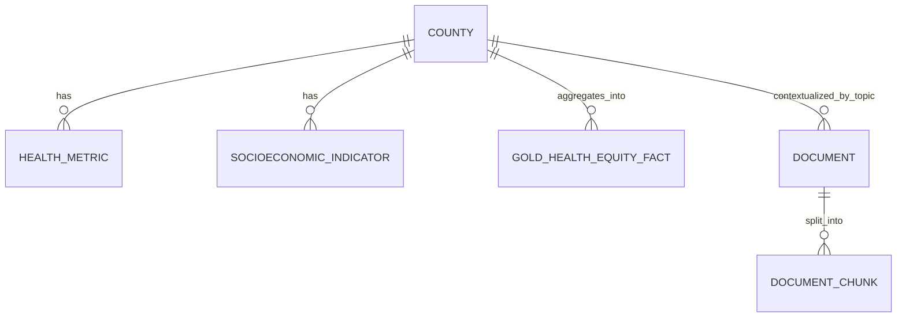

# Winter 2026 DE Bootcamp Capstone Proposal (Draft 2)

**Date:** 2026-03-25  
**POC:** Capstone Student (VitalDocs AI builder)  
**TL;DR:** Build a Databricks-native **Health Equity Intelligence Platform** that combines structured public health indicators (CDC PLACES + Census ACS) with unstructured CDC/WHO guidance documents to power (1) a gold-layer analytics dashboard (primary demo) and (2) a citation-grounded agentic Q&A workflow (required secondary demo). MVP must be fully functional in cloud by **2026-03-28**, with **2026-03-29** reserved for polish/hardening.

---

## 1) Project Description / Scope

### Project Title
**Health Equity Intelligence Platform (Databricks + Dashboard-First + Citation-Grounded Agent)**

### Problem Statement
Current health document assistants often fail when users ask questions outside a narrow corpus. This project addresses that gap by building a production-style DE platform that unifies:
- **Structured population health data** (county-level health + social determinant indicators),
- **Unstructured public health guidance** (CDC/WHO documents),
- **Agentic retrieval workflow** that answers user questions with verifiable citations.

### Scope (Capstone)
- Build a **medallion architecture** (Bronze/Silver/Gold) on Databricks + S3.
- Ingest and transform at least **two meaningful data inputs** with joins/aggregations.
- Add **data quality controls** at ingestion and transform stages.
- Deliver **agentic action(s)** via citation-grounded retrieval over curated documents.
- Deliver a **cloud-hosted gold-layer visualization** through Databricks SQL Dashboard.

### Demo Strategy (Locked)
- **Primary:** Dashboard-first (DE reliability + stakeholder analytics value).
- **Secondary (required):** Agentic Q&A with citations over the same governed data foundation.

### In Scope by Delivery Tier
- **MVP Functional (by 2026-03-28):** End-to-end batch medallion pipeline, dashboard, citation-grounded agent flow, lean eval gate.
- **Polish/Buffer (2026-03-29):** Demo hardening + selective low-risk improvements.
- **Phase 2 (post-MVP):** Graph RAG, streaming, deeper eval/automation.

### Explicitly Out of Scope for MVP
- Graph RAG as a required core deliverable.
- Streaming/Kafka for periodic source systems.
- Full VitalDocs backend migration (Supabase → Databricks).
- Any scope that compromises MVP reliability by 2026-03-28.

---

## 2) Conceptual Data Model & Diagram

### Core Entities
- **County**: FIPS, state, county name
- **HealthMetric**: prevalence/rate fields from CDC PLACES
- **SocioEconomicIndicator**: ACS-derived indicators (income, education, insurance, etc.)
- **Document**: CDC/WHO source metadata (title, source, publish date, URL)
- **DocumentChunk**: parsed chunk text + embedding metadata
- **GoldHealthEquityFact**: curated analytical county-level fact table for dashboard and agent grounding

### Conceptual ER (high level)

### Graph Extension (Phase 2)
If time permits post-MVP, add Neo4j nodes/relationships:
- Nodes: `Disease`, `RiskFactor`, `Intervention`, `County`, `Document`
- Edges: `ASSOCIATED_WITH`, `INCREASES_RISK_OF`, `RECOMMENDED_FOR`, `LOCATED_IN`, `CITED_BY`

---

## 3) Tools, Data Sources, and Formats

### Platform & Tooling
- **Databricks Workspace** (bootcamp-provided)
- **Storage:** Delta Lake on **S3**
- **Transform/Orchestration:** Databricks Jobs / DLT expectations
- **Visualization:** Databricks SQL Dashboard
- **Agent Layer (MVP):**
  - **Structured analytics lane:** Databricks **Genie** for text→SQL over governed Gold tables.
  - **Document evidence lane (primary):** Databricks **Agent Bricks Knowledge Assistant** over the 5 locked CDC/WHO collections (docs landed to Unity Catalog Volume; managed chunking/embedding/index/serving with citations and guardrails).
  - **Document evidence lane (fallback):** notebook-based retrieval orchestration over Vector Search if Agent Bricks is temporarily unavailable in workspace.
- **LLMOps:** MLflow tracking + evaluation (`mlflow.evaluate()`), prompt/version tracking in MLflow/Unity Catalog

### Agentic Implementation Boundary (Explicit)
- **Yes in MVP:** two-lane pattern
  1. Genie text→SQL for structured, dashboard-consistent analytical questions.
  2. Agent Bricks Knowledge Assistant for citation-grounded CDC/WHO evidence-backed recommendations.
- **Not in MVP core:** Supervisor Agent patterns and custom multi-agent orchestration via LangChain/LangGraph.
- **Why:** protects 2026-03-28 reliability deadline and keeps architecture aligned to DE-first capstone grading priorities while using Databricks-managed agentic capabilities.
- **Fallback path:** if Agent Bricks is blocked by workspace constraints, use notebook-based citation RAG over Vector Search to preserve MVP timeline.
- **Phase 2 path:** evaluate Agent Framework and optional multi-agent orchestration only after protected-core MVP is stable.

### Data Sources (Locked MVP Corpus + Structured Base)
1. **CDC PLACES** (structured, county-level chronic disease indicators)  
   - Format: CSV/API extract  
   - Cadence: periodic (batch)
2. **U.S. Census ACS** (structured socioeconomic indicators)  
   - Format: API/CSV extract  
   - Cadence: periodic (batch)
3. **CDC/WHO document corpus (5 locked collections)**  
   - CDC Advancing Health Equity Collection  
   - CDC Mapping Chronic Disease Collection  
   - CDC Rural Health Disparities (2025)  
   - CDC Health Equity Science / SDOH documentation  
   - WHO World Health Statistics 2025  
   - Format: HTML/PDF with PDF fallbacks  
   - Cadence: periodic publication updates (batch)

### File/Zone Strategy
- **Bronze:** raw landed files/tables exactly as sourced
- **Silver:** cleaned/conformed data with standardized keys (FIPS, dates, metric definitions)
- **Gold:** analytical marts + agent-serving artifacts

---

## 4) Ingestion Strategy & Data Quality Checks

### Ingestion Strategy
1. **Structured ingestion**
   - Pull CDC PLACES + ACS snapshots on schedule.
   - Land raw data in Bronze with ingestion metadata.
2. **Unstructured ingestion**
   - Pull CDC/WHO pages/PDFs, parse/chunk in Silver.
   - Generate embeddings and publish retrieval index.
3. **Integration**
   - Build Gold county-level facts combining outcomes + social determinants.
   - Link retrieval context by topic/geography where applicable.
4. **Serving**
   - SQL gold tables for dashboard.
   - Citation-grounded retrieval path for agent demos.

### Data Quality Controls
Using DLT expectations / SQL checks:
- **Schema validation:** required columns exist and types are valid.
- **Completeness checks:** key fields (`county_fips`, `metric_name`, `value`, `source_date`) non-null.
- **Uniqueness checks:** no duplicate `(county_fips, metric, period)` in curated layers.
- **Range checks:** percentage/prevalence fields constrained to plausible bounds.
- **Referential integrity:** county records join to conformed county dimension.
- **Freshness checks:** ingestion timestamp within expected update windows.
- **Document QA checks:** non-empty extracted text, minimum chunk length, embedding success rate.

### Why Streaming Is Deferred
Streaming was evaluated and explicitly deferred: source systems (CDC PLACES, ACS, CDC/WHO publications) are periodic and do not require sub-hour latency. Batch scheduling is the correct MVP architecture for reliability, cost, and delivery speed.

---

## 5) Success Metrics & Stakeholder Value

### Technical Success Metrics (MVP Gates)
- Pipeline reliability: successful scheduled runs (%)
- Data quality pass rate: DLT expectations pass/fail trends
- Gold table usability: completeness + dashboard consistency
- Agent quality (lean MVP thresholds):
  - **Groundedness/Faithfulness >= 80%**
  - **Citation correctness >= 85%**
  - **Relevance >= 80%**
  - **Failure rate < 10%**
  - **Latency target:** p95 under ~10–15s (demo practical target)
- Demo reliability: >= 80% pass per required demo question variants/reruns, 0 fabricated citations

### Lean MVP Evaluation Plan
- Build a gold eval set of **15–25 questions**.
- Include factual lookup, synthesis/comparison, county/equity interpretation.
- Use at least one simple baseline comparison (prompt/retrieval variant), logged in MLflow.
- Track minimal operational metrics (latency, errors, cost/token if readily available).

### Product/Stakeholder Value
- **Analysts/public health stakeholders:** county-level clarity on where burden and social determinants intersect.
- **Practitioners/policy users:** evidence-backed interventions with source citations.
- **Engineering stakeholders:** reusable cloud pattern (medallion + quality + agent access) for future domains.

---

## Delivery Plan (Execution-Locked)

### Protected Core Scope (Non-Negotiable under 20–30% cut)
1. Running Bronze/Silver/Gold pipeline for **CDC PLACES + ACS** with quality checks.
2. Gold-layer dashboard that supports required analytics demo questions.
3. Citation-grounded agentic workflow over locked 5-collection corpus.
4. Lean MVP evaluation gate (15–25 questions + numeric thresholds).
5. Cloud-running deployment + concise runbook (manual/notebook deployment acceptable for MVP).

### First Items to Defer if Schedule Tightens
- DAB packaging/environment promotion automation.
- Eval depth beyond lean MVP gates.
- Corpus expansion beyond locked 5 collections.
- Extra UX polish beyond required dashboard + agent path.
- Graph RAG and streaming (already Phase 2).

### Timeline
- **2026-03-25 to 2026-03-27:** Build/harden protected core pipeline + dashboard + retrieval flow.
- **2026-03-28:** MVP functional deadline (end-to-end run + demo readiness + eval evidence).
- **2026-03-29:** Buffer/polish and optional low-risk hardening (e.g., partial DAB packaging if time permits).

---

## Capstone Requirement Traceability

| Requirement | Proposed Implementation |
|---|---|
| One or more pipelines | Medallion ETL + doc parse/chunk/embedding pipeline |
| Data quality controls | DLT expectations + integrity/freshness/range checks |
| Deployed in cloud | Databricks on S3 (manual/notebook deployment for MVP) |
| Agentic action(s) | Citation-grounded retrieval workflow over curated corpus |
| 2+ inputs with joins/aggregations | CDC PLACES + ACS primary joins, CDC/WHO docs for evidence context |
| Gold-standard output | Curated gold facts + dashboard + cited Q&A |

---

## Risks & Mitigations

- **Risk:** Key mismatches across structured sources  
  **Mitigation:** early county-dimension standardization with strict FIPS normalization.
- **Risk:** Unstructured extraction noise  
  **Mitigation:** parsing QA checks + chunk strategy experiments tracked in MLflow.
- **Risk:** Scope creep near deadline  
  **Mitigation:** enforce protected-core gate and defer listed stretch items.
- **Risk:** Late deployment packaging complexity  
  **Mitigation:** keep MVP modular/parameterized so DAB can be added post-MVP without blocking submission.

---

## Demo Questions (Must Answer Reliably)

1. “Which counties show the worst diabetes burden, and what social factors are most associated with those outcomes?”  
2. “Compare rural vs urban patterns for obesity and heart disease in [state/region], and explain likely drivers.”  
3. “Given these disparities, what evidence-based interventions do CDC/WHO sources recommend for similar communities?”

These serve as both narrative spine and measurable acceptance checks for MVP readiness.